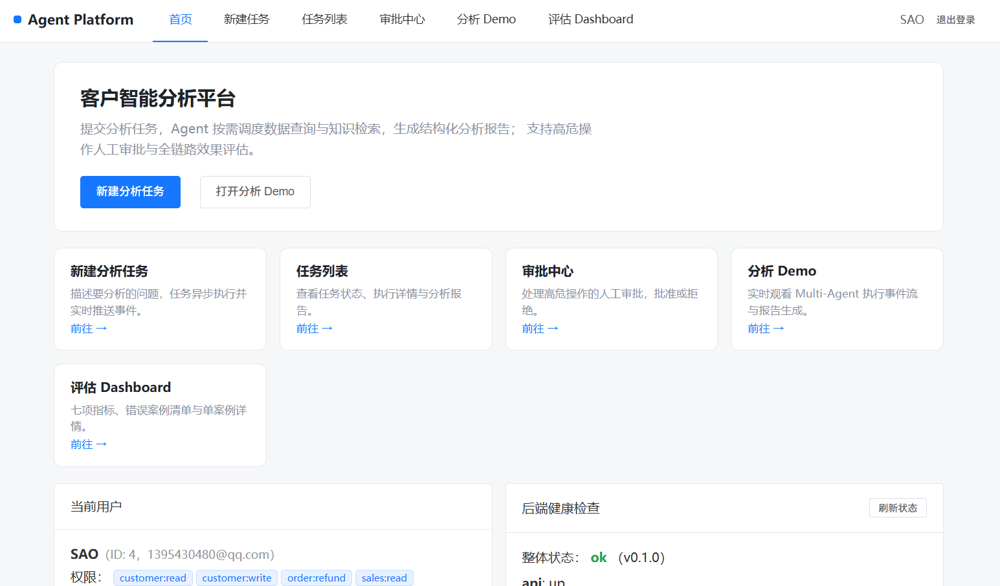
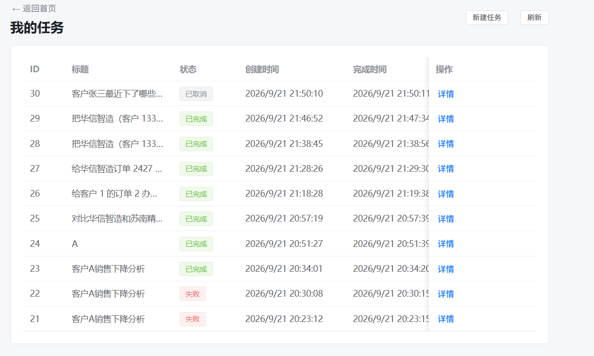
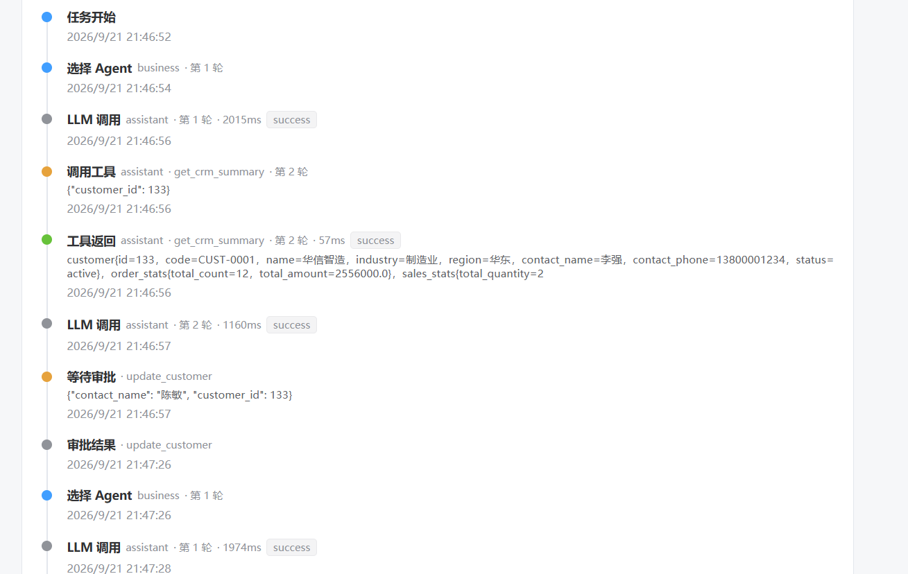
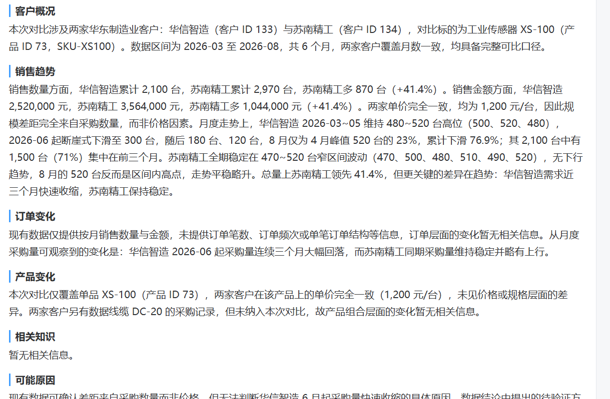
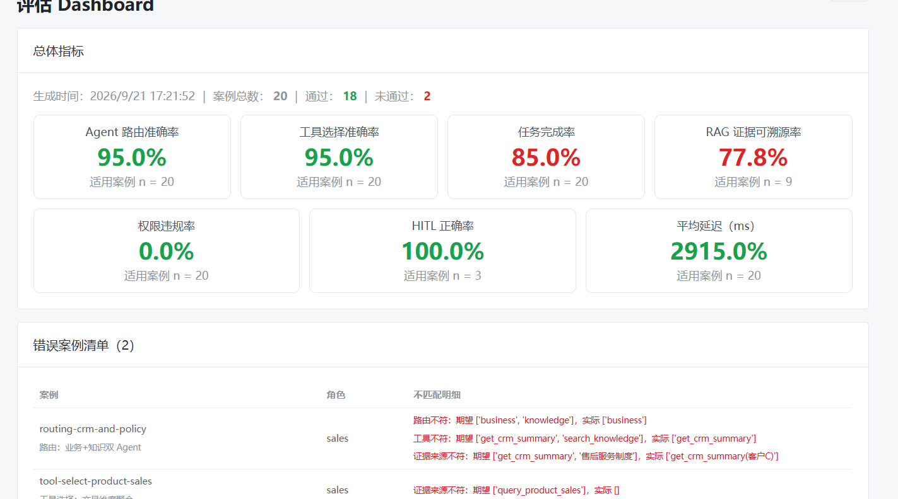
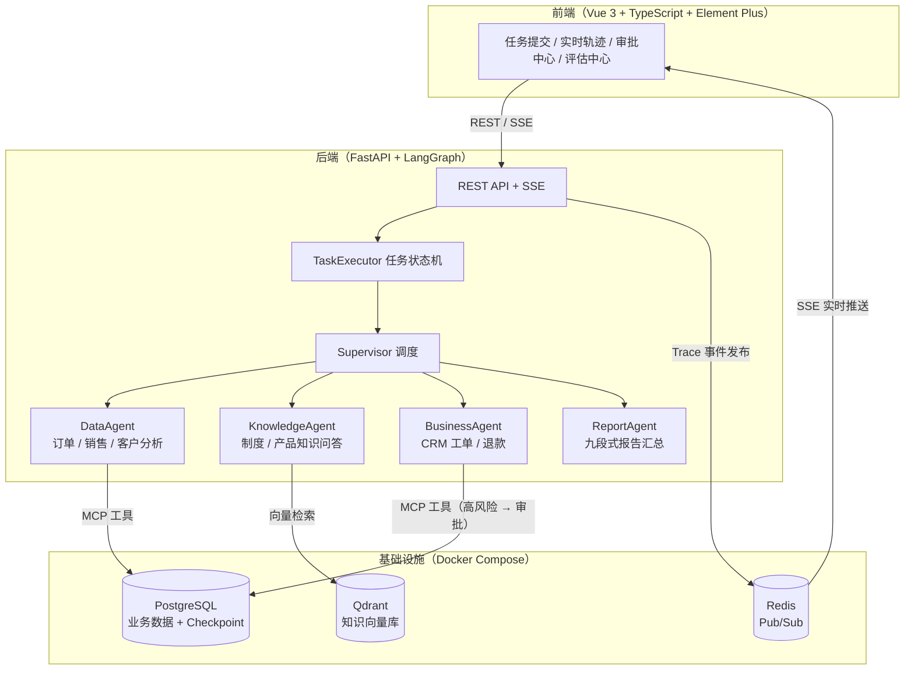

# Agent Platform · 客户智能分析多 Agent 系统

<div align="center">


</div>

基于 **LangGraph** 的多 Agent 协作平台：Supervisor 智能调度数据、知识、业务三类专业 Agent，围绕 CRM 场景完成「客户销售额下降归因分析」等复杂任务，全链路 SSE 实时可观测，高风险操作人工审批（HITL），并内置声明式评估体系。

> **关键数字**：348 个自动化测试 · 12 种全链路 Trace 事件 · 20 条评估用例 × 7 项量化指标 · 9 个 MCP 业务工具

---

## 项目演示
**首页**


**任务列表**


**LLM调用时间轴**


**分析报告**


**评估页面**


---

## 核心特性

- **多 Agent 编排**：LangGraph 实现 Supervisor（路由决策 ⇄ 串行调度 ⇄ 汇总）+ DataAgent / KnowledgeAgent / BusinessAgent / ReportAgent 四个专业 Agent，各 Agent 复用统一的 LLM ↔ Tool 循环图，支持轮次守卫与失败降级
- **RAG 检索链路**：Markdown 标题感知分块 → 本地 Embedding（embeddinggemma-300m）→ Qdrant 向量检索 → CrossEncoder 重排（bge-reranker-base）→ 相关性阈值过滤 → LLM 查询改写二次召回，全程参数化配置、零硬编码
- **HITL 人工审批**：高风险工具（订单退款 / 修改客户资料）调用前输出结构化风险评估，经 LangGraph interrupt 挂起任务 → 审批中心批准 / 拒绝 → 断点续跑或安全终止
- **全链路可观测 + SSE 实时推送**：12 种 Trace 事件（任务 / Agent / 工具 / LLM / 审批）全程落库，经 Redis Pub/Sub → SSE 心跳推送，前端实时渲染执行轨迹；Cookie 过期自动续期重连
- **任务全生命周期**：状态机驱动（`PENDING → RUNNING → WAITING_APPROVAL → COMPLETED / FAILED / CANCELLED`），基于 Checkpoint 边界的安全取消，全部接口所有权校验
- **评估体系**：20 条声明式评估用例（路由 / 工具选择 / RAG 问答 / 权限拒绝 / HITL / 降级）× 7 项量化指标（Agent 路由准确率、工具选择准确率、任务完成率、Groundedness 等），一键运行并输出 HTML / JSON 报告
- **生产级工程化**：MCP 工具注册中心 + 风险等级白名单；JWT + HttpOnly Cookie 认证；安全响应头（CSP / HSTS）/ GZip / 静态资源长缓存；生产模式下后端直接托管前端 SPA

## 系统架构



**一次典型分析**：用户提交「分析客户 A 销售额下降的原因」→ Supervisor 路由至 DataAgent 检索订单与投诉数据 → 路由至 KnowledgeAgent 检索售后制度 → ReportAgent 交叉归纳「核心产品供货不稳定」结论，生成带证据溯源（document_id / chunk_id）的九段式结构化报告，全程事件实时推送到前端。

## 技术栈

| 层 | 技术 |
|----|------|
| 后端 | Python 3.11 · FastAPI · LangGraph（Checkpoint 持久化）· SQLAlchemy 2.0 (async) · Alembic · Pydantic v2 · FastMCP |
| AI / RAG | OpenAI 兼容 LLM API（DeepSeek / 通义 / GPT 等可切换）· sentence-transformers 本地 Embedding · CrossEncoder 重排 · Qdrant |
| 前端 | Vue 3 · TypeScript · Vite · Pinia · Vue Router · Element Plus · SSE（EventSource + HttpOnly Cookie） |
| 基础设施 | PostgreSQL 16 · Redis 7（Pub/Sub）· Docker Compose |
| 质量保障 | pytest 348 用例（单元 / API / E2E / 评估）· fakeredis · Ruff |

## 快速开始

### 环境要求

- Python ≥ 3.11、Node.js ≥ 20、Docker

### 1. 启动基础设施

```bash
docker compose up -d   # PostgreSQL / Redis / Qdrant
```

### 2. 配置环境变量

```bash
cp .env.example .env
# 至少修改：LLM_BASE_URL / LLM_API_KEY / LLM_MODEL（任意 OpenAI 兼容服务）
```

### 3. 初始化并启动后端

```bash
cd backend
python -m venv .venv
.venv\Scripts\activate            # Windows；Linux/macOS: source .venv/bin/activate
pip install -e ".[dev]"

alembic upgrade head              # 建表
python -m app.seed                # 生成演示数据 + 知识文档（幂等，可重复执行）
python -m app.rag.ingest          # 知识文档向量化入库（首次运行自动下载模型）

uvicorn app.main:app --reload     # http://localhost:8000  API 文档: /docs
```

### 4. 启动前端（新终端）

```bash
cd frontend
npm install
npm run dev                       # http://localhost:5173
```

> Windows 下也可运行根目录的 `start_all.bat` 一键启动（自动拉起 Docker 与前后端）。

### 生产构建

```bash
cd frontend && npm run build      # 产物输出到 frontend/dist
# .env 已默认 FRONTEND_DIST_DIR=frontend/dist，后端启动时自动托管 SPA（安全头 / GZip / 静态缓存）
```

## 功能体验路径

1. 注册账号并登录
2. 首页 → **智能分析**：预置问题一键提交，实时观看 Supervisor 调度与工具调用轨迹
3. 任务详情页：SSE 实时事件流（当前 Agent / 工具 / 状态）→ 终态后查看九段式报告与证据溯源
4. 提交高风险任务（如「给客户 X 的订单退款」）→ **审批中心** 批准或拒绝 → 任务续跑或终止
5. **评估中心**：一键运行 20 条评估用例，查看 7 项量化指标与失败用例归因

## 项目结构

```
├── backend/
│   ├── app/
│   │   ├── agents/            # LangGraph 编排：Supervisor / 4 个专业 Agent / Graph / Checkpoint
│   │   ├── api/routes/        # REST API：auth / tasks / approvals / trace / evaluation
│   │   ├── core/              # 配置 / LLM Client / Redis / 安全中间件 / 错误处理
│   │   ├── mcp/               # MCP 工具注册中心：database / knowledge / business 工具
│   │   ├── rag/               # 分块 / Embedding / 向量库 / 重排 / 查询改写 / 入库
│   │   ├── evaluation/        # 评估用例 / Runner / 指标计算 / HTML·JSON 报告
│   │   ├── models/ · repositories/ · services/ · schemas/   # 领域分层
│   │   └── seed.py            # 演示数据（客户销售下降评估案例链）
│   ├── migrations/            # Alembic 数据库迁移
│   └── tests/                 # 348 个 pytest 用例
├── frontend/
│   └── src/
│       ├── views/             # 登录 / 首页 / 智能分析 / 任务列表·详情 / 审批中心 / 评估中心
│       ├── composables/       # useTaskStream：SSE 订阅 / 事件流 / 降级轮询
│       └── api/ · components/ · stores/ · router/
├── docs/                      # 案例链数据设计文档
│   └── screenshots/           # 项目运行截图（TODO：放入你的截图）
├── docker-compose.yml         # PostgreSQL / Redis / Qdrant
└── start_all.bat              # Windows 一键启动
```

## 测试

```bash
cd backend
pytest                             # 348 passed
pytest tests/test_e2e_sales_drop.py   # 仅运行端到端用例
```

测试覆盖：Agent 编排与工具循环、RAG 检索与重排、任务状态机与取消、HITL 审批闭环、Trace 事件 SSE 推送（11 类事件顺序断言）、权限与所有权校验、评估体系等。
